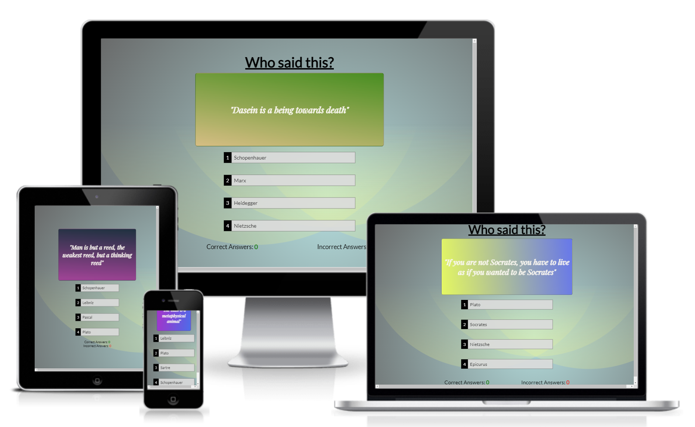
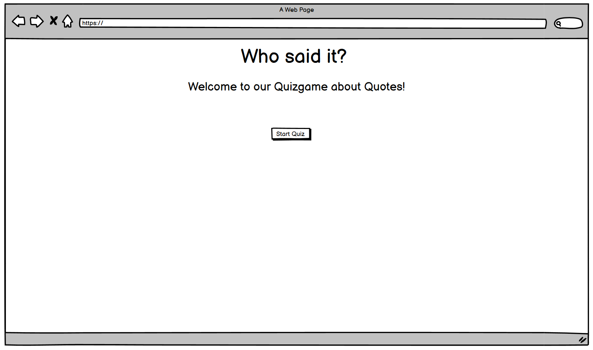
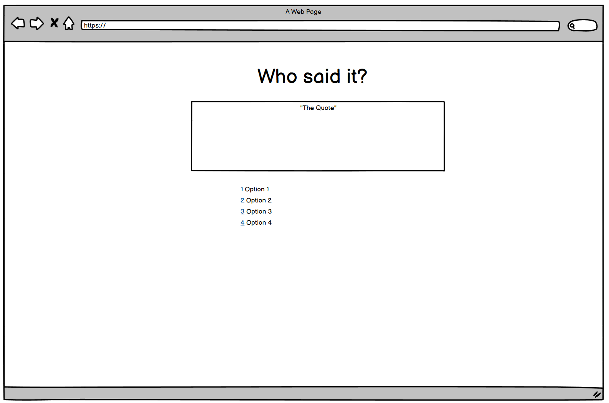
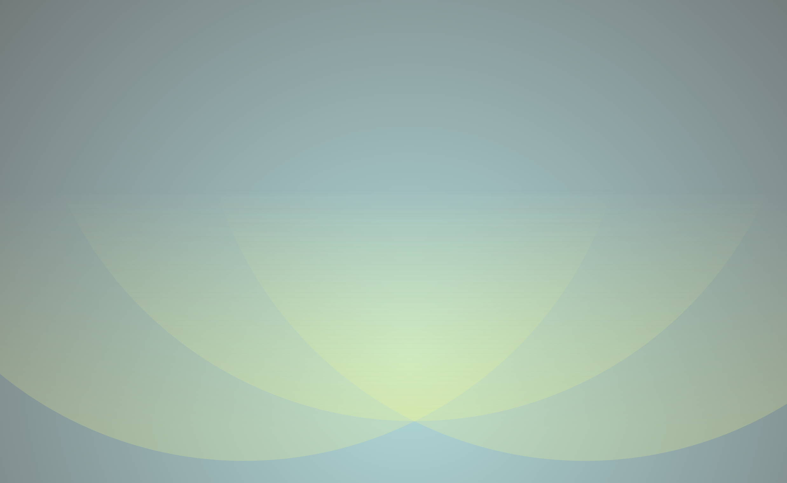
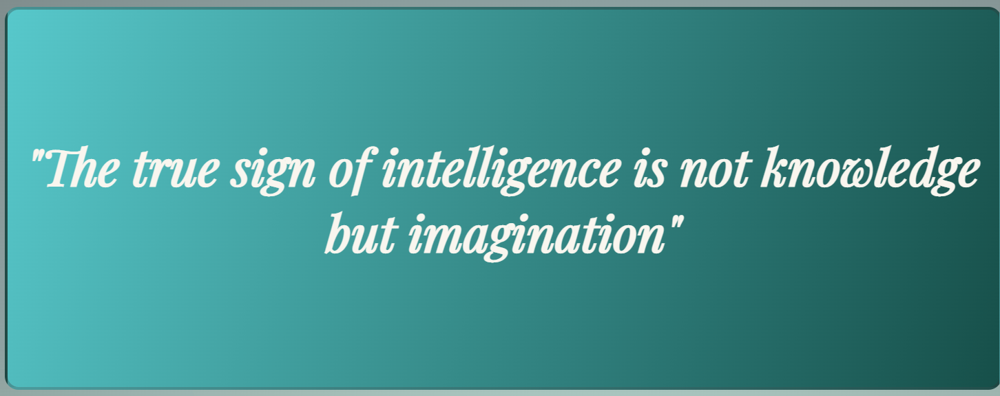
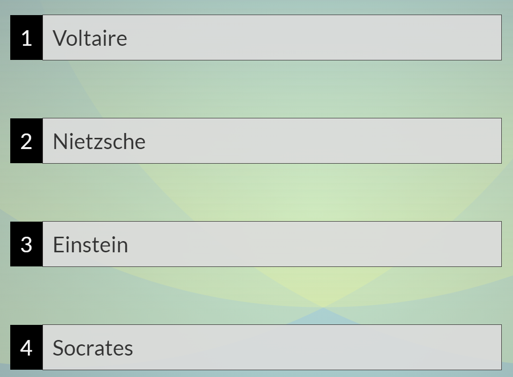
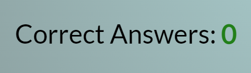
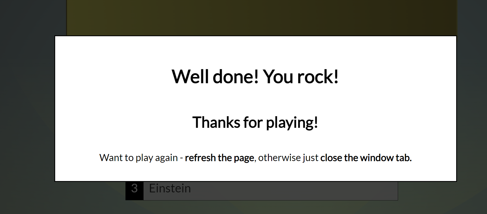
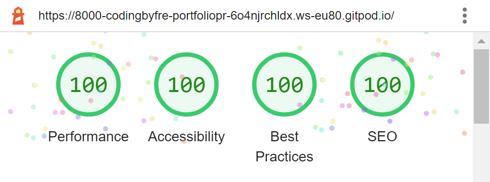
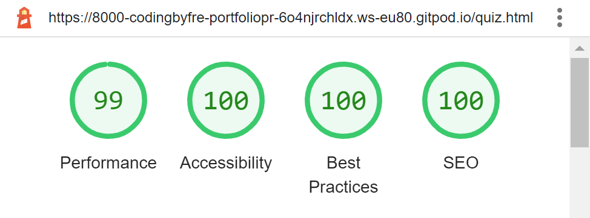

# Quiz Time!
 
 ## Welcome to my second Portfolio Project!
  For my 2nd project i choose a quizgame. This was a fun way to incorporate my love for philosopy aswell as coding. The user gets to answer 5 random questions out of a 20 question pool. Theres a mainpage where you click the start button to come to the quiz page. All the quotes are more or less famous all from the ancient greeks right up until the 20's century. The goal with this project is to make a fun, challenging quiz for eveyone to enjoy. But also a chance for the user to sit down and really read and grasp what the quotes means (thats why there is no timelimit to answer).
  
 

## Technologies Used

 For this project we were allowed to use these three programming languages: 

 - [HTML](https://sv.wikipedia.org/wiki/HTML5)
 - [CSS](https://en.wikipedia.org/wiki/CSS)
 - [Javascript](https://en.wikipedia.org/wiki/JavaScript)

## Design

### Colour Scheme
* My mentor from [CI](https://codeinstitute.net) gave me the idea for the random gradient linear effect behind the quotes. The background is blueish/grayish and yellow "rose pedal"-template. The letters are classic black except for the quotes themself, they are bonewhite. 

### Typography
* For this pages the fonts are Lato and Playfair Display. Playfair Display for the quotes and Lato for everything els. I choose Lato because of the modern/stylish way it looks and Playfair Display for the quotes because of the more classic look.

### Wireframes
* Wireframeswise i wanted to go with something simple and pragmatic, to focus on the quiz-part itself.
 

## Features

* ### Background 
    * The background is "rose pedals" from svgbackgrounds.com. 
     
    

* ### Favicon
    * Displayed on the tab. 
    * Choose the thinking emoji to emphasize the philosophy and "deep thinking" vibe.
     
    

* ### Start button
    * On the main page.
    * Takes the user to the quiz page
     
    
    
* ### The Quote
    * Random gradient linear background that changes with the quote
    * A total for 20 diffrent quotes. 
    
    
* ### The Choices
    * 4 diffrent alternatives
    * Right answer gives a green background, wrong answer gives a red background.
    * All the choices have one or more Quotes included in the 20 quote pool. 
    
    
 * ### Scoring systen
    * Keeps score. The user gets a correct answer for a right answer and a incorrect score for a wrong answer.
     
    
    

* ### Modal
    * After 5 quotes a modal pops up. 
    * Backdrop gives the background a dark tone.
    * The user can choose to either refresh the page to play again or close the tab.
     
    

## Testing

* Tested on three diffrent browsers: Edge, Chrome and Firefox.  
* Tested it with dev tools, playing the quiz itself.
* Checked responsiveness (using dev tools) on Desktops, Laptops, Tablets and Mobile. 

### Validator Testing

* #### HTML
    * No errors or warnings returned when passing through the official W3C validator.

* #### CSS 
    * No errors or warnings returned when passing through the official (Jigsaw) validator.

* #### Javascript
    * There were 34 warnings when testing code through the JSHint validator. 33 of them where "const/let/arrowfunction is available in ES6 (use 'esversion: 6') or Mozilla JS extensions (use moz)." and 1 warning was 
    "198 [number] is better written in dot notation." No corrections were made.

* #### Lighthouse Score
    * Checked both main page and quiz page using lighthouse (main page upper, quiz page lower)
 

   

### Bugs

#### No major bugs encountered

### Deployment
* The website was deployed to GitHub pages. The steps to deploy are as follows (when using [Gitpod](https://www.gitpod.io/)):
    * In the GitHub repository, navigate to the 'Settings' tab.
    * From the meny on the left, select the 'Pages'.
    * Under the first category "Build and deployment", select "main" in the sub-category "Branch".
    * Press the save-button.
    * "Your site is now live." *happy dance*
    * The live website can be found [here](https://codingbyfreddish.github.io/Portfolio-Project-2/)

## Credits

### Content
* [The Love Maths Project](https://github.com/codingbyfreddish/love-maths) from [CI](https://codeinstitute.net) in regards of both design/layout ideas as well as code. The scoring system is code from there.
* All the course material from [CI's 'Full Stack Developer'](https://codeinstitute.net/se/full-stack-software-development-diploma/) curriculum leading up to this project.
* Some code, ideas and general javascript knowledge (such f.e arrowfunctions) from [Code Geeks quiz tutorial](https://www.youtube.com/watch?v=Opje9VBrNfg&t=3208s&ab_channel=CodeGeek), [Web Dev Simplified](https://www.youtube.com/@WebDevSimplified), [CodingNepal](https://www.youtube.com/@CodingNepal) and [Codepen](https://codepen.io/). 
* During the project i got alot of ideas, learned alot and got was greatly influensed by these sources mentioned above.
* [Stack Overflow](https://stackoverflow.com/) for various things along the project.
* Background is from [svgbackgrounds.com/](https://www.svgbackgrounds.com/)
* [Google Fonts](https://googlefonts.com) is used for the text fonts. 
* [Favicon](https://favicon.io/) is used for the tab icon.
* The quotes are from [https://www.the-philosophy.com/](https://www.the-philosophy.com/top-20-philosophical-quotes)
* Wireframes from [Balsamiq](https://balsamiq.com/)

## Acknowledgments
* **My Mentor Ronan McClelland came up with some great ideas to really elevate the project, and for future projects as well. Thank you Ronan!**

